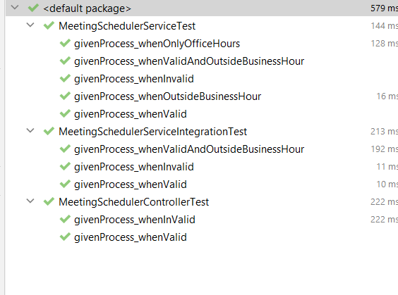

# Problem

Your company has an existing legacy system for employees to submit booking requests for meetings
in the boardroom. The system keeps the requests in a text file (format below). Your employer has
now asked you to implement a system for processing batches of booking requests. And you need to
expose a REST api that will accept the text input and process them based on the booking rules and
returns a structured json response as below.

# Guidlines
Your processing system must process input as text. The first line of the input paylod
represents the company office hours, in 24 hour clock format (ignore timezones), and the
remainder of the input represents individual booking requests. Each booking request is in
the following format:
[Request submission time, in YYYY-MM-DD HH:MM:SS format] [Employee id]
[Meeting start time, in YYYY-MM-DD HH:MM format] [Meeting duration in hours]

# Sample Input

0900 1730

2020-01-18 10:17:06 EMP001

2020-01-21 09:00 2

2020-01-18 12:34:56 EMP002

2020-01-21 09:00 2

2020-01-18 09:28:23 EMP003

2020-01-22 14:00 2

2020-01-18 11:23:45 EMP004

2020-01-22 16:00 1

2020-01-15 17:29:12 EMP005

2020-01-21 16:00 3

2020-01-18 11:00:45 EMP006

2020-01-23 16:00 1

2020-01-15 11:00:45 EMP007

2020-01-23 15:00 2

2020-01-18 11:23:45 EMP004

2020-01-20 12:00 1

# Processing Guidlines

- No part of a meeting may fall outside of office hours (9:00 to 18:00).
- Meetings may not overlap.
- The booking submission system only allows one submission at a time, so submission
  times are guaranteed to be unique.
- Booking must be processed in the chronological order in which they were submitted.
- The ordering of booking submissions in the supplied input is not guaranteed.

#Output

[
{
"data": "2020-01-20",
"bookings": [
{
"emp_id": "EMP004",
"start_time": "12:00:00",
"end_time": "13:00:00"
}
]
},
{
"data": "2020-01-21",
"bookings": [
{
"emp_id": "EMP001",
"start_time": "09:00:00",
"end_time": "11:00:00"
}
]
},
{
"data": "2020-01-22",
"bookings": [
{
"emp_id": "EMP003",
"start_time": "14:00:00",
"end_time": "16:00:00"
},
{
"emp_id": "EMP004",
"start_time": "16:00:00",
"end_time": "17:00:00"
}
]
},
{
"data": "2020-01-23",
"bookings": [
{
"emp_id": "EMP006",
"start_time": "16:00:00",
"end_time": "17:00:00"
}
]
}
]

# Swagger

http://localhost:8080/meeting-scheduler/swagger-ui/index.html#/

# Test Case

